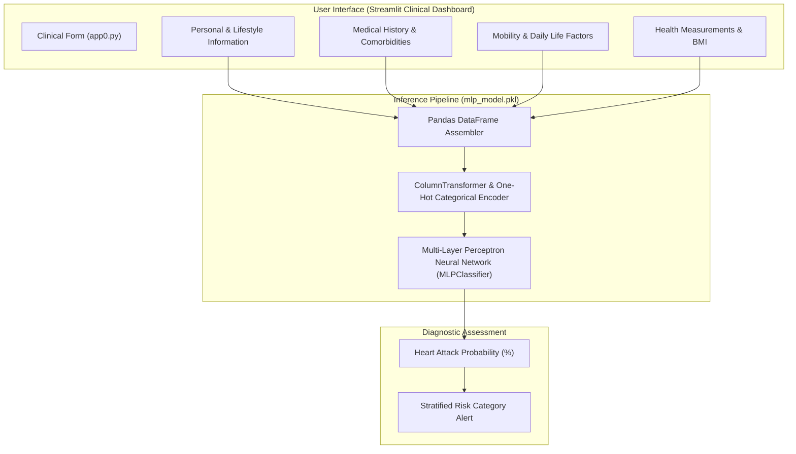

<br/><br/>

<!-- Animated Title -->
<p align="center">
  <a href="#">
    
  </a>
</p>

<p align="center">
  <b>Production Clinical Machine Learning System for Cardiovascular Event Likelihood Assessment</b><br/>
  <i>Multi-Layer Perceptron (MLP) Neural Network · Multi-Factor Comorbidity Modeling · CDC Heart Disease Indicators · Interactive Streamlit Clinical Studio</i>
</p>

<br/>

<!-- Badges Row 1: Core Technologies -->
<p align="center">
  
  
  
  
  
</p>

<!-- Badges Row 2: Clinical Standards & License -->
<p align="center">
  
  
  
  
</p>

<br/>

<!-- Quick Navigation Bar -->
<p align="center">
  <a href="#-overview"></a>
  &nbsp;
  <a href="#-problem-statement--clinical-solution"></a>
  &nbsp;
  <a href="#-clinical-feature-domains"></a>
  &nbsp;
  <a href="#%EF%B8%8F-system-architecture"></a>
  &nbsp;
  <a href="#-machine-learning-pipeline"></a>
  &nbsp;
  <a href="#-quickstart--execution"></a>
</p>

---

## 📌 Overview

**Heart Attack Detection** is a clinical decision-support machine learning system engineered to assess the probability of acute myocardial infarction (heart attack) based on comprehensive personal, behavioral, and clinical comorbidity indicators.

Trained on the **CDC Behavioral Risk Factor Surveillance System (BRFSS)** epidemiological dataset, the system deploys a **Multi-Layer Perceptron (MLP) Neural Network** encapsulated within an end-to-end scikit-learn preprocessing pipeline (`mlp_model.pkl`). The accompanying **Streamlit Clinical Studio** enables primary care clinicians, occupational health officers, and individuals to simulate cardiovascular risk profiles across dozens of interdependent health variables.

```
                      ┌────────────────────────────────────────────────────────┐
                      │             Cardiovascular Risk Engine                 │
                      │                                                        │
[ Patient Profile:   ]┼──> [ Pipeline Preprocessor & One-Hot Encoder ]         ├──> [ Diagnostic Risk Score ]
[ Lifestyle & History]│             │                                          │    - Probability (%)
                      │             ▼                                          │    - Binary Classification
                      │    [ Multi-Layer Perceptron (MLP) ] ──> Risk Logits    │    - Stratified Risk Tier
                      │             │                                          │    - Clinical Guidance
                      │             ▼                                          │
                      │    [ Calibrated Sigmoid Output ]    ──> Clinical Risk  │
                      └────────────────────────────────────────────────────────┘
```

---

## 🎯 Problem Statement & Clinical Solution

<table>
<tr>
<td width="50%" valign="top">

### ❌ The Cardiovascular Disease Burden

Cardiovascular diseases remain the leading cause of mortality worldwide:

- ⏳ **Asymptomatic Progression**: Atherosclerosis and hypertension develop quietly over decades without acute symptoms until a cardiac event occurs.
- 🧩 **Multi-Factorial Complexity**: Risk is not determined by a single biomarker but by the compounding synergy of smoking, diabetes, age, BMI, and prior stroke/angina.
- 📋 **Fragmented Screening**: Routine health screenings often lack accessible predictive tools that synthesize lifestyle data into actionable risk metrics.

</td>
<td width="50%" valign="top">

### ✅ The Machine Learning Solution

| Challenge | Architectural Solution |
| :--- | :--- |
| **Synergistic Risk Modeling** | **MLP Neural Network**: Deep interconnected hidden layers capture non-linear interactions across diverse clinical factors. |
| **Comprehensive Feature Scope** | Encodes **Demographics**, **Lifestyle Factors**, **Chronic Comorbidities**, and **Physical Health Metrics**. |
| **Serialized Pipeline Bundle** | **Self-Contained Joblib Pipeline** (`mlp_model.pkl`) managing one-hot encoding, imputation, and inference in one call. |
| **Interactive Clinical Studio** | **Streamlit** multi-column dashboard with specialized clinical categories and instant probabilistic assessment. |

</td>
</tr>
</table>

---

## 🔥 Clinical Feature Domains

<table>
<tr>
<td width="33%" align="center" valign="top">

### 👤 Lifestyle & Demographics
<br/>
<b>Behavioral Factors</b>
<p align="left">
• Age bracket & biological sex<br/>
• Smoker status & E-cigarette usage<br/>
• Alcohol consumption habits<br/>
• Physical activity frequency<br/>
• Sleep duration & mental health days
</p>

</td>
<td width="33%" align="center" valign="top">

### 🏥 Comorbidities
<br/>
<b>Medical History</b>
<p align="left">
• Prior Angina / CAD diagnosis<br/>
• History of Stroke<br/>
• Chronic Kidney Disease<br/>
• Diabetes mellitus diagnosis<br/>
• Asthma, COPD & Arthritis
</p>

</td>
<td width="33%" align="center" valign="top">

### 📊 Vital Biomarkers
<br/>
<b>Physical Health</b>
<p align="left">
• Body Mass Index (BMI)<br/>
• Height and weight ratios<br/>
• Mobility & concentration difficulties<br/>
• Annual checkup recency<br/>
• General health self-rating
</p>

</td>
</tr>
</table>

---

## 🏗️ System Architecture



---

## ⚙️ Technical Stack

| Component | Technology | Purpose & Implementation |
| :--- | :--- | :--- |
| **Neural Network** | **Scikit-Learn MLPClassifier** | Multi-layer perceptron with backpropagation and non-linear activations |
| **Preprocessing Pipeline** | **Scikit-Learn Pipeline** | Unified categorical encoding and feature alignment |
| **Interactive Interface** | **Streamlit** | Multi-column clinical risk prediction dashboard |
| **Data Structures** | **Pandas & NumPy** | Vectorized patient record assembly and feature extraction |
| **Model Serialization** | **Joblib** | Serialized model and pipeline bundle (`mlp_model.pkl`) |
| **Dataset Source** | **CDC BRFSS** | CDC Heart Disease Indicators epidemiological dataset |

---

## 📁 Repository Structure

```
Heart-Attack-Detection/
├── 📄 app0.py                          # Interactive Streamlit clinical risk prediction application
├── 📄 diabetes-eda-and-detection (1).ipynb # Comprehensive EDA, feature selection & training notebook
├── 📄 mlp_model.pkl                    # Serialized MLP neural network pipeline bundle
├── 📊 diabetes_prediction_dataset (1).csv # Training and evaluation dataset
├── 📄 Requirements.txt                 # Dependencies
├── 📁 .devcontainer/                   # Development container configuration
└── 📄 README.md                        # Documentation
```

---

## 🚀 Quickstart & Execution

### Prerequisites
- **Python**: 3.10 or higher
- **Virtual Environment**: Recommended

---

### 1. Installation

```bash
# 1. Clone repository
git clone https://github.com/IbrahimAbdelsattar/Heart-Attack-Detection.git
cd Heart-Attack-Detection

# 2. Create virtual environment
python -m venv venv
source venv/bin/activate        # On Windows: .\venv\Scripts\activate

# 3. Install dependencies
pip install -r Requirements.txt
pip install streamlit scikit-learn pandas numpy joblib
```

---

### 2. Launching the Clinical Dashboard

```bash
streamlit run app0.py
```

*The application will boot at `http://localhost:8501`.*

---

## 👥 Author & Connect

**Ibrahim Abdelsattar**  
*AI Engineer & Machine Learning Specialist*

- 🌐 **GitHub**: [@IbrahimAbdelsattar](https://github.com/IbrahimAbdelsattar)
- 💼 **LinkedIn**: [Ibrahim Abdelsattar](https://www.linkedin.com/in/ibrahim-abdelsattar/)
- 📧 **Email**: [ibrahimabdelsattar042@gmail.com](mailto:ibrahimabdelsattar042@gmail.com)

---

<p align="center">
  <sub>Engineered for clinical intelligence, preventive medicine, and cardiovascular health analytics. © 2026 Heart Attack Detection.</sub>
</p>
