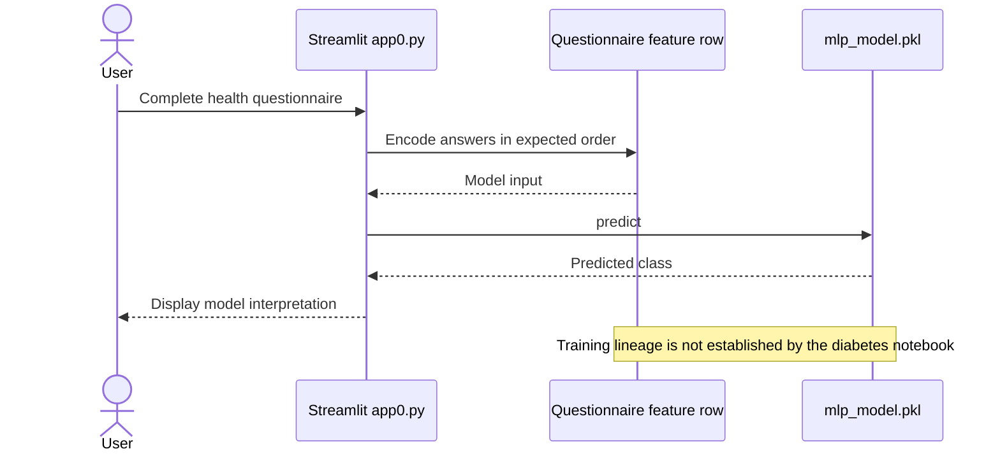

# Heart Attack Classification Demo

A Streamlit interface that loads a saved MLP pipeline and classifies a health questionnaire. The repository also contains a separate diabetes analysis notebook.

**Technology:** Python · scikit-learn · joblib · pandas · Streamlit

## Features

- Collect demographic, lifestyle, health-history, and accessibility inputs.
- Pass the questionnaire DataFrame to the saved pipeline.
- Display the predicted class returned by the model.

## Repository guide

| Path | Purpose |
|---|---|
| [app0.py](app0.py) | Heart attack questionnaire and pipeline inference. |
| [mlp_model.pkl](mlp_model.pkl) | Saved pipeline used by the app. |
| [diabetes-eda-and-detection (1).ipynb](diabetes-eda-and-detection%20%281%29.ipynb) | Separate diabetes EDA and classification experiments. |
| [diabetes_prediction_dataset (1).csv](diabetes_prediction_dataset%20%281%29.csv) | Dataset associated with the diabetes notebook. |
| [Requirements.txt](Requirements.txt) | App dependencies. |

## Requirements and current limitations

The notebook's target is diabetes, while `app0.py` presents a heart attack classifier. The diabetes notebook does not establish the training provenance or validation of `mlp_model.pkl` for the app's target. Verify the artifact's training schema before interpreting its output.

The application is an educational demonstration, not a clinically validated diagnosis or risk forecast. Keep the saved pipeline compatible with its original scikit-learn environment.

## UML diagrams

### Main workflow

This is the app0.py inference path. The separate diabetes notebook and dataset are not established as training sources for this heart-risk model.



## Getting started

```bash
git clone https://github.com/IbrahimAbdelsattar/Heart-Attack-Detection.git
cd Heart-Attack-Detection
```

Use a Python virtual environment:

```bash
python -m venv .venv
```

Activate it with `source .venv/bin/activate` on macOS/Linux or `.venv\Scripts\Activate.ps1` in PowerShell.

```bash
python -m pip install -r Requirements.txt
python -m streamlit run app0.py
```
